# 🎯 AI Ground Truth Generator

> **A complete, extensible platform for generating high-quality ground truth data for AI/RAG applications**

Transform your subject matter experts' knowledge into training data that actually works. This full-stack application provides a **working template** that development teams can immediately use and extend for their own AI solutions.

```mermaid
flowchart TD
    A[👤 Subject Matter Expert] --> B[📋 Create Collection]
    B --> C[❓ Add Questions]
    C --> D[🔍 Retrieve Documents]
    D --> E[📄 Source Documents]
    E --> F[🤖 Generate Answers]
    F --> G[📝 AI-Generated Answers]
    G --> H[✅ Expert Review]
    H --> I{Quality Check}
    I -->|✅ Approve| J[📤 Export Training Data]
    I -->|❌ Revise| K[✏️ Edit & Improve]
    K --> H
    I -->|❓ Needs Context| L[📚 Add More Documents]
    L --> D
    
    style A fill:#e1f5fe
    style J fill:#e8f5e8
    style I fill:#fff3e0
    style K fill:#ffeaa7
    style L fill:#fdcb6e
```



## 🚀 What You Get: End-to-End Ground Truth Pipeline

This isn't just another demo—it's a **production-ready foundation** that solves the real challenge of getting quality training data from domain experts:

### 📋 **Collection Management**

Organize your ground truth work into logical collections, track progress, and manage team collaboration.

### ❓ **Question Handling**

Add questions that need expert answers, categorize by domain, and track them through the entire workflow.

### 🔍 **Document Retrieval**

Automatically fetch relevant source documents from your data sources using configurable retrieval providers.

### 🤖 **AI Answer Generation**

Generate initial answers using configurable AI models (Azure OpenAI, local models, or custom providers).

### ✅ **Expert Review Process**

Enable subject matter experts to review, approve, revise, and provide feedback on generated answers.

### 📤 **Export for Training**

Export approved Q&A pairs in formats ready for model training, fine-tuning, or RAG evaluation.

---

## 🎬 Try It Now: 60-Second Demo

**Get the complete workflow running in under a minute:**

```bash
# Clone and start the application
git clone <repository-url>
cd ise-ai-ground-truth-generator
docker-compose up

# Open your browser to http://localhost:3000
# Login with: demo / password
# Explore collections, Q&A generation, and review workflows
```

**That's it!** You now have a fully functional ground truth generation platform running locally with demo data.

### 🔍 What to Explore in the Demo

1. **Login** → Use `demo` / `password` to access the platform
2. **Collections** → See how ground truth work is organized
3. **Add Questions** → Experience the question input workflow  
4. **Retrieve Documents** → Watch automatic document fetching
5. **Generate Answers** → See AI-powered answer generation
6. **Review Process** → Try the expert review and approval workflow
7. **Export Data** → Download training-ready Q&A pairs

The demo uses in-memory storage and mock AI responses, so you can immediately see the complete workflow without any external dependencies.

---

## 🏗️ Architecture: Built for Extension

This platform uses a **provider pattern** that makes it easy to swap out components without touching core logic:

```mermaid
graph LR
    subgraph "🖥️ Frontend Layer"
        A[React + TypeScript<br/>📱 Extensible UI<br/>🔐 Auth Providers]
    end
    
    subgraph "⚙️ Backend Layer" 
        B[FastAPI + Python<br/>🔄 Provider Pattern<br/>🛡️ Type Safety<br/>📖 OpenAPI Docs]
    end
    
    subgraph "🔌 Provider Layer"
        C[🔐 Authentication<br/>Simple Demo Auth<br/>→ Extend for Production Auth]
        D[🗄️ Database<br/>In-Memory Storage → PostgreSQL/MongoDB]
        E[🔍 Data Sources<br/>Memory + Template Providers<br/>→ Azure Search/Elasticsearch/SharePoint]
        F[🤖 AI Models<br/>Demo Response Generator<br/>→ OpenAI/Azure OpenAI/Local Models]
    end
    
    A <--> B
    B <--> C
    B <--> D
    B <--> E
    B <--> F
    
    style A fill:#e3f2fd
    style B fill:#f3e5f5
    style C fill:#fff3e0
    style D fill:#e8f5e8
    style E fill:#fce4ec
    style F fill:#f1f8e9
```



### 🔧 Architecture: Built for Extension

| Component | What's Included | Extension Examples |
|-----------|----------------|-------------------|
| **🔐 Authentication** | Simple demo auth (`demo`/`password`) | Azure AD B2C, Auth0, Custom LDAP |
| **🗄️ Database** | In-memory storage (demo only) | PostgreSQL, MongoDB, SQL Server |
| **🔍 Data Sources** | Mock documents (demo only) | Azure Search, Elasticsearch, SharePoint |
| **🤖 AI Generation** | Template responses (demo only) | Azure OpenAI, OpenAI, Local models |

> **⚠️ Important:** The demo includes basic implementations only. Production extensions require additional development following the provider pattern.

---

## 🎯 Perfect For Teams Building RAG Applications

### The RAG Ground Truth Challenge

Building effective RAG (Retrieval-Augmented Generation) applications requires high-quality ground truth data:

- **Questions** your users will actually ask
- **Documents** that contain the right information
- **Answers** that correctly interpret those documents
- **Human validation** from subject matter experts

This creates the foundation for measuring both **retrieval metrics** (did we find the right documents?) and **generation metrics** (did we produce accurate answers from those documents?).

### How This Platform Helps

1. **📝 Capture Real Questions** → Collect actual user questions and expert scenarios
2. **🔍 Test Retrieval** → Verify your search finds the right documents  
3. **🤖 Validate Generation** → Ensure AI correctly interprets retrieved content
4. **✅ Expert Review** → Get domain expert validation before training
5. **📊 Measure Quality** → Track approval rates and identify improvement areas

---

## 🛠️ Extension Architecture

### Backend: Provider Pattern Ready

The FastAPI backend uses a clean provider pattern designed for easy extension. Each component implements a base interface:

```python
# Example: Your custom data source
class SharePointProvider(BaseDataSourceProvider):
    async def retrieve_documents(self, query: str) -> List[Document]:
        # Your SharePoint integration
        pass

# Register in factory.py
if RETRIEVAL_PROVIDER == "sharepoint":
    return SharePointProvider()
```

**Extension Framework Supports:**

- **Authentication:** Any identity provider (base interface provided)
- **Databases:** Any persistent storage (base interface provided)  
- **Data Sources:** Any document/search system (base interface provided)
- **AI Models:** Any text generation service (base interface provided)

> **📝 Note:** Base interfaces and demo implementations are included. Production providers require implementation following the established patterns.

### Frontend: React + Provider Pattern

The React frontend mirrors the backend's extensibility:

```typescript
// Your authentication provider
export class CustomAuthProvider implements AuthService {
  async signIn(credentials: SignInRequest): Promise<AuthResult> {
    // Your custom authentication integration
  }
}

// Environment-driven configuration
REACT_APP_AUTH_PROVIDER=custom
```

### Backend: Use Your Framework

While this template uses FastAPI/Python, the architecture translates to any backend framework:

```typescript
// Node.js/Express example
interface IDataSourceProvider {
  async retrieveDocuments(query: string): Promise<Document[]>
}

// Register providers based on config
const dataSourceProvider = createProvider(process.env.DATA_SOURCE_PROVIDER)
```

**Framework Translation:**

- **Node.js/Express** → Factory pattern with dependency injection
- **.NET Core** → Built-in DI container with interface registration
- **Java Spring** → Component scanning and autowiring
- **Go** → Interface composition and factory functions

Use the [API specification](/docs/backendAPIs.md) and [architecture patterns](/docs/backendArchitecture.md) as your implementation guide.

### Frontend: Use Your Stack

- **Vue.js/Nuxt** → Follow the same API patterns
- **Angular** → Implement the service interfaces  
- **Svelte** → Use the OpenAPI spec for type generation
- **Mobile** → React Native, Flutter, or native apps

---

## 🚀 Getting Started

### Option 1: Quick Demo (Recommended)

```bash
git clone git@github.com:bryanostdiek_microsoft/rag_ground_truth_generator.git
cd rag_ground_truth_generator
docker-compose up
```

Visit `http://localhost:3000` and login with `demo` / `password`.

### Option 2: Development Setup

```bash
# Backend
cd backend
uv sync  # or pip install -e .
uv run uvicorn app:app --reload

# Frontend  
cd frontend
npm install
npm start
```

### Option 3: Production Deployment

> **⚠️ Production Readiness:** This demo includes in-memory storage and mock providers only. For production deployment, you'll need to:
>
> - Implement persistent database providers (PostgreSQL, MongoDB, etc.)
> - Add production authentication (Azure AD B2C, Auth0, etc.)
> - Configure real data sources (Azure Search, Elasticsearch, etc.)
> - Set up actual AI model providers (Azure OpenAI, OpenAI, etc.)
>
> The provider pattern architecture makes this straightforward - see the [Extension Guides](#-extension-guides) for implementation examples.

Deployment strategies will depend on your specific infrastructure and requirements. The Docker setup provides a foundation that can be adapted for cloud platforms or on-premises deployments.

---

## 📚 Documentation

### 🎯 **Quick Start Guides**

- **[60-Second Demo](#-try-it-now-60-second-demo)** → Get running immediately
- **[Extension Overview](/docs/extensions.md)** → Understand the provider pattern

### 🏗️ **Architecture Deep Dives**

- **[Backend Architecture](/docs/backendArchitecture.md)** → FastAPI, providers, and extension points
- **[Frontend Architecture](/docs/frontendArchitecture.md)** → React patterns and extensibility
- **[API Reference](/docs/backendAPIs.md)** → Complete endpoint documentation

### 🔧 **Extension Guides**

- **[Backend Extensions](/docs/extensions.md)** → Add custom providers and integrations
- **[Frontend Extensions](/docs/frontendExtensions.md)** → Customize UI and add features
- **[Frontend APIs](/docs/frontendAPIs.md)** → Service layer and API integration

### 📖 **Component READMEs**

- **[Backend Details](/backend/README.md)** → FastAPI setup, uv, testing, and development
- **[Frontend Details](/frontend/README.md)** → React setup, state management, and testing

---

## 🔍 Use Cases

### 💼 **Enterprise RAG Applications**

- Customer support knowledge bases
- Internal documentation Q&A
- Compliance and policy guidance
- Technical troubleshooting systems

### 🎓 **AI Model Training**

- Fine-tuning language models
- RAG evaluation datasets  
- Chatbot training data
- Domain-specific AI assistants

---

## 🤝 Contributing

This is a **template project** designed for teams to fork and customize. We welcome:

- **🐛 Bug Reports** → Issues with the demo or documentation
- **📖 Documentation** → Improve setup guides and examples  
- **🔧 Provider Examples** → Additional provider implementations
- **💡 Feature Requests** → Enhancements that benefit multiple teams

---

## 🆘 Support

- **📖 Documentation Issues** → Create an issue in this repository
- **💬 Implementation Questions** → Use GitHub Discussions for this repository
- **🐛 Bug Reports** → Create an issue in this repository
- **🚀 Feature Requests** → Use GitHub Discussions for this repository

---

**Ready to get started?** Run `docker-compose up` and login with `demo` / `password` to see the full workflow in action! 🎯
