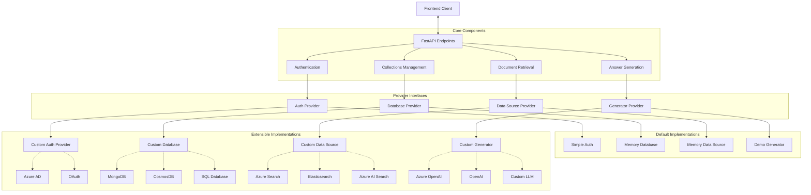
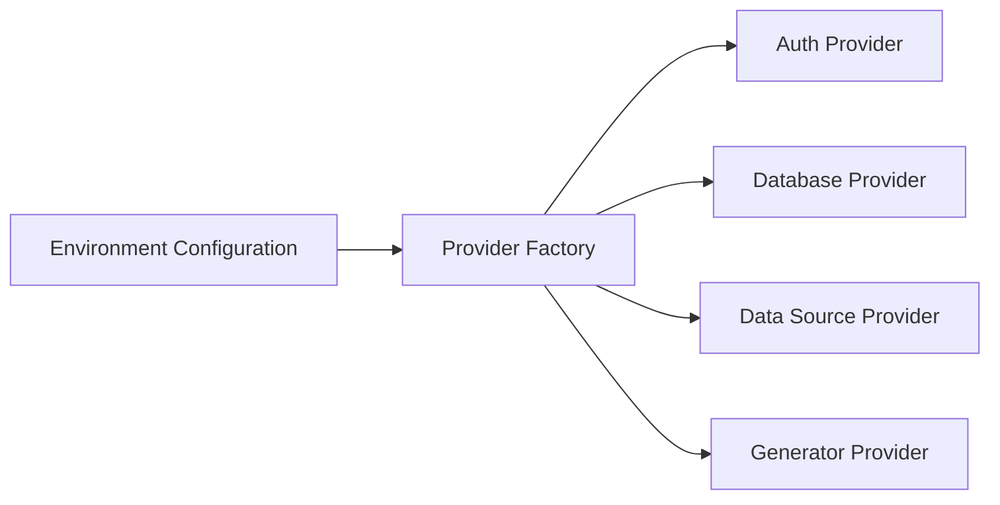
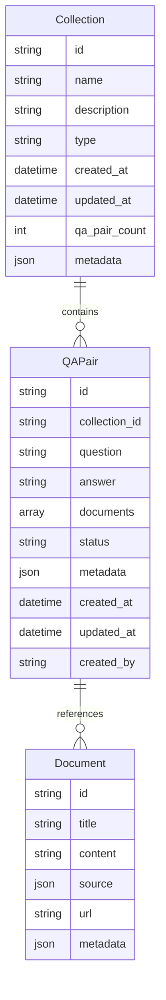
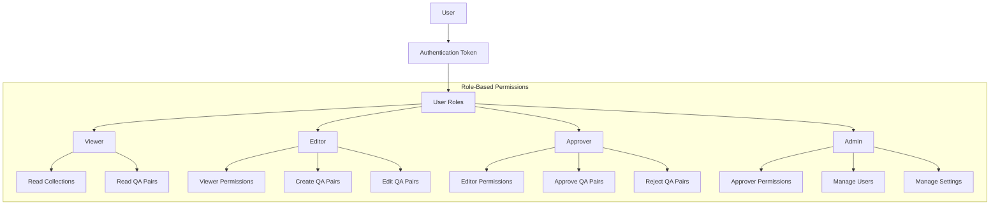
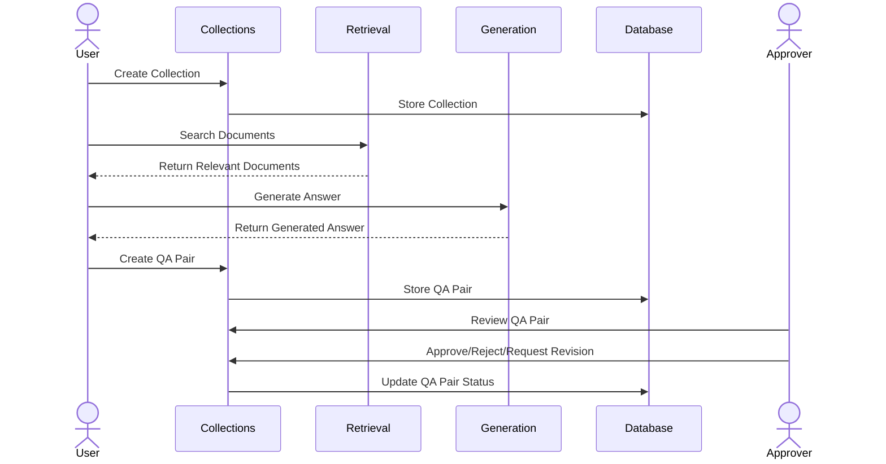

# AI Ground Truth Generator - Backend Architecture

This document provides a high-level overview of the AI Ground Truth Generator backend architecture, explaining the key components, their relationships, and extension points.

## System Overview

The AI Ground Truth Generator is designed to help teams create, manage, and maintain high-quality question-answer pairs for AI training. The system follows a modular architecture with clearly defined interfaces, allowing teams to customize and extend various components based on their specific requirements.

## Key Components

### API Layer (FastAPI)

The API layer provides RESTful endpoints for interacting with the system. These endpoints are organized into routers based on functionality:

- **Auth Router**: Handles user authentication and authorization
- **Collections Router**: Manages collections and QA pairs
- **Retrieval Router**: Provides document retrieval capabilities
- **Generation Router**: Handles answer generation

### Provider Interfaces

The system uses a provider pattern to allow for extensible implementations:

- **Auth Provider**: Interface for authentication and authorization
- **Database Provider**: Interface for data storage and retrieval
- **Data Source Provider**: Interface for document retrieval
- **Generator Provider**: Interface for answer generation

### Factory System

A factory system is used to instantiate the appropriate provider implementations based on configuration:

## Data Model

The core data model revolves around Collections and QA Pairs:

## Extension Points

The system is designed to be extended in several ways:

1. **Custom Database Provider**: Replace the memory database with a persistent database
2. **Custom Data Source Provider**: Implement custom document retrieval logic
3. **Custom Generator Provider**: Integrate with LLM services for answer generation
4. **Custom Auth Provider**: Implement robust authentication and authorization

## RBAC and Security

The system supports role-based access control through the authentication provider:

## Workflow

The typical workflow for QA pair creation and management:

## Technology Stack

- **Framework**: FastAPI
- **Default Database**: In-memory (for development)
- **Authentication**: Simple JWT (for development)
- **Document Retrieval**: In-memory (for development)
- **Answer Generation**: Demo generator (for development)

## Configuration

The system is configured using environment variables:

- `DATABASE_PROVIDER`: The database provider to use (default: "memory")
- `AUTH_PROVIDER`: The authentication provider to use (default: "simple")
- `RETRIEVAL_PROVIDER`: The retrieval provider to use (default: "template")
- `GENERATION_PROVIDER`: The generation provider to use (default: "demo")
- `ENABLED_DATA_SOURCES`: Comma-separated list of enabled data sources (default: "memory")

## Next Steps

For implementing a production system, consider:

1. Implementing a persistent database provider
2. Integrating with a robust authentication system
3. Implementing vector-based document retrieval
4. Integrating with production-ready LLM services
