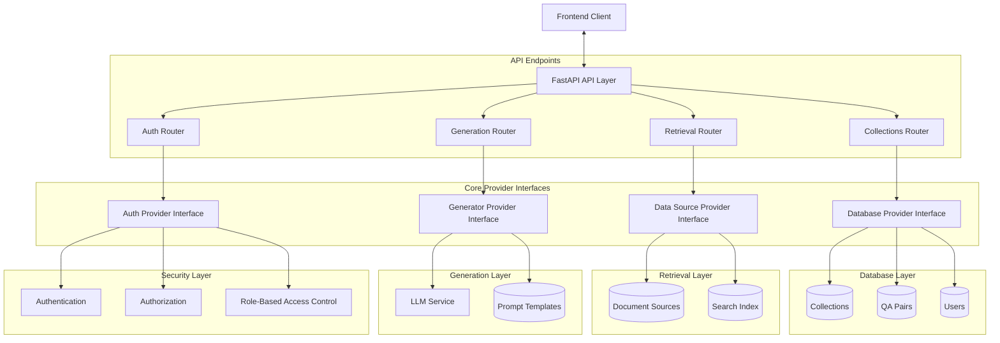
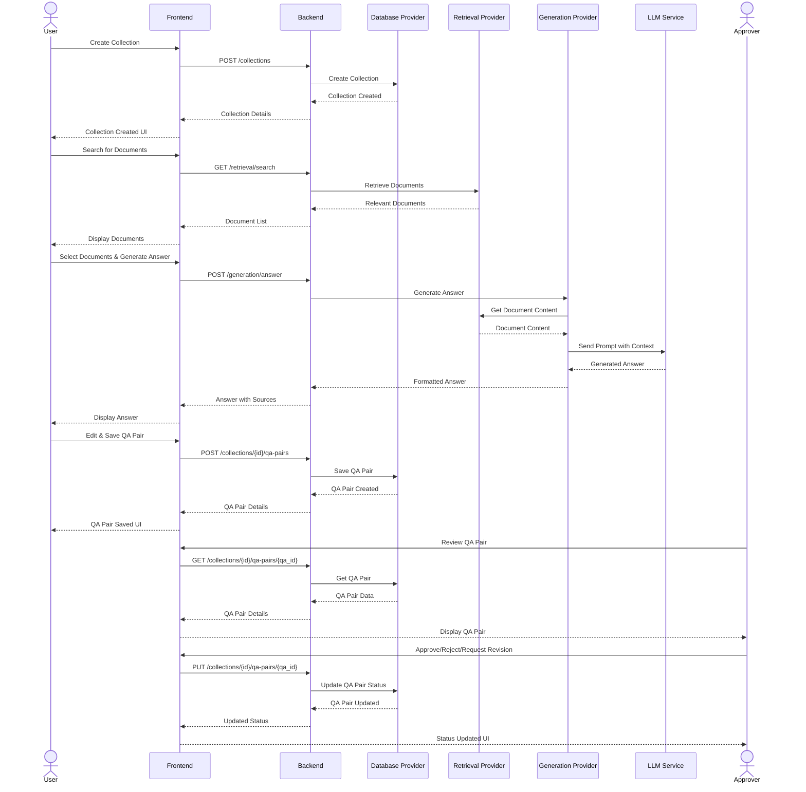
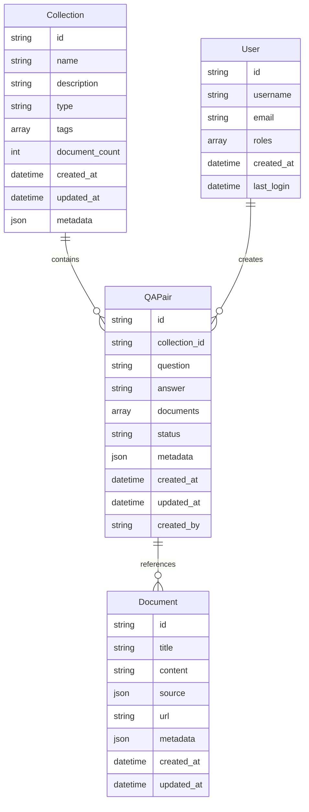
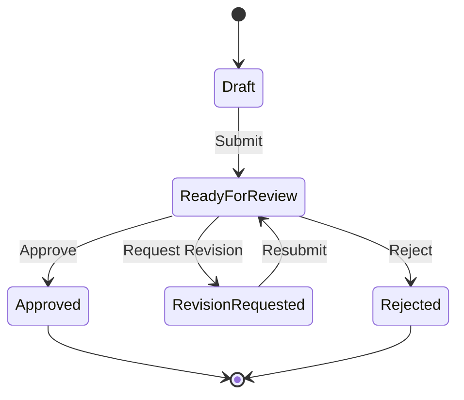
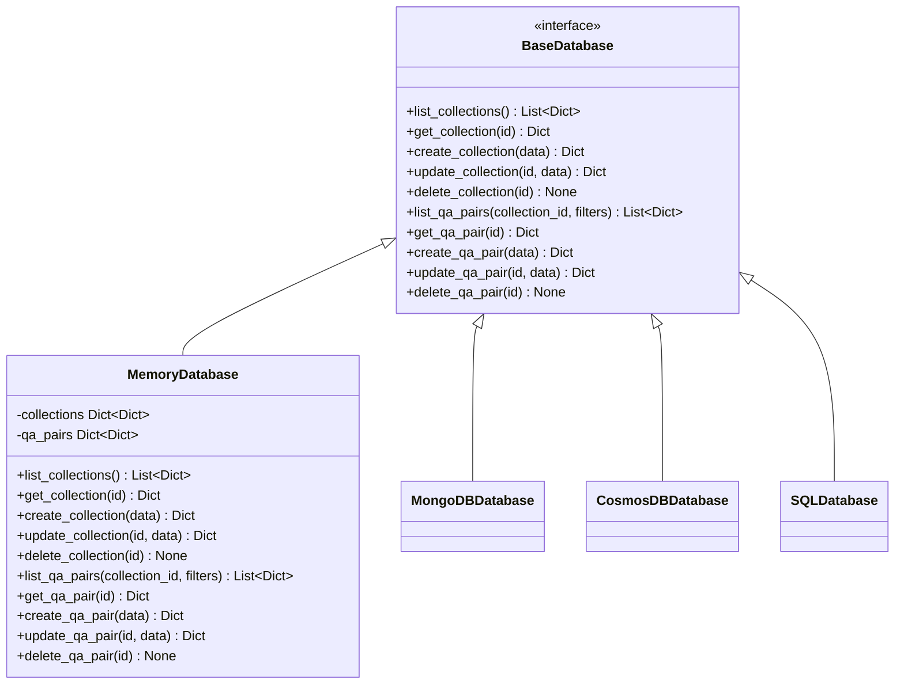
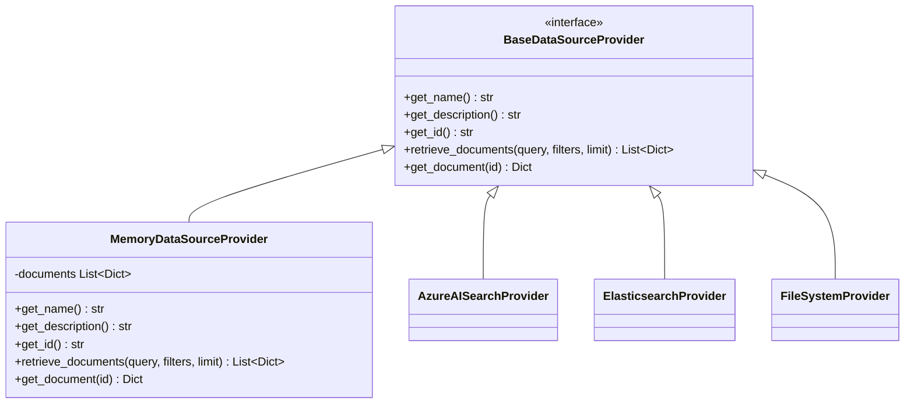
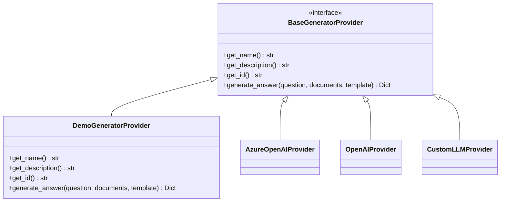
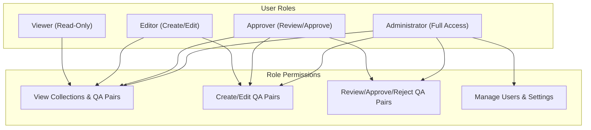
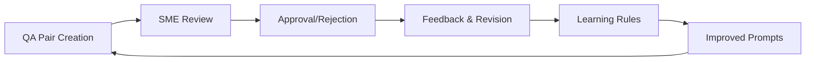

# Backend Architecture

This document provides a detailed overview of the AI Ground Truth Generator backend architecture, with a specific focus on the data storage, retrieval, and answer generation components.

## High-Level Architecture

The backend follows a modular, provider-based architecture that enables flexible customization and extension of various components.

## Data Flow

The following diagram illustrates the data flow through the system when generating and storing QA pairs:

## Data Models

### Core Data Models

The system uses three primary data models:

### QA Pair Statuses

QA pairs go through a workflow with the following statuses:

## Provider Interfaces

### Database Provider

The Database Provider is responsible for storing and retrieving collections and QA pairs.

### Data Source Provider

The Data Source Provider is responsible for retrieving documents from various sources.

### Generator Provider

The Generator Provider is responsible for generating answers from documents.

## Role-Based Access Control

The system supports role-based access control (RBAC) for controlling access to resources:

## Learning and Feedback Loop

The system incorporates a feedback loop for continuous improvement:

## Extension Points

The system is designed to be extended in several ways:

1. **Custom Database Providers**: Integrate with different database systems
2. **Custom Data Source Providers**: Connect to various document sources and search engines
3. **Custom Generator Providers**: Integrate with different LLM services
4. **Custom Auth Providers**: Implement different authentication and authorization mechanisms

## Next Steps for Implementation

For a production-ready implementation, consider:

1. **Persistent Database**: Implement a database provider using MongoDB, CosmosDB, or SQL
2. **Vector Search**: Implement a data source provider with vector-based search capabilities
3. **Production LLM Integration**: Integrate with Azure OpenAI or another production LLM service
4. **Advanced Authentication**: Implement Azure AD or OAuth-based authentication
5. **Comprehensive Logging**: Add detailed logging for audit and debugging purposes
